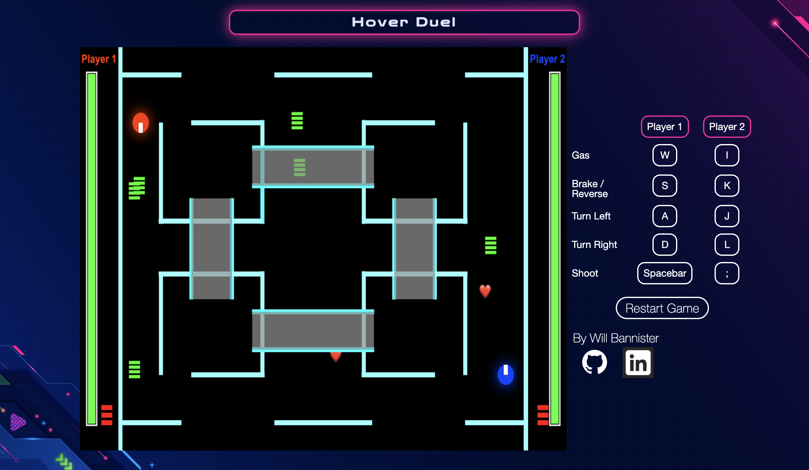

# Hover Duel

Hover Duel is a multiplayer battle game set in space where you launch bouncing projectiles at your opponent's craft to destroy it. The map has multiple levels/floors and the game evolves through a series of rounds. Players can pick up health and ammo and drive across platform bridges. 

The game is similar to Mario Kart’s Battle Mode ([https://www.mariowiki.com/Battle_Mode](https://www.mariowiki.com/Battle_Mode)). The user can drive around the grid with WASD, fire projectiles at opponents and fire projectiles with other keys. Players will lose health when hit by projectiles. Currently, the game is 2-player with no CPUs.

The user’s perspective will be a fixed aerial view of the map. While appearing 2D, the map has platforms and aerial bridges. The mouse is not be utilized outside of menu navigation.


## Functionality & MVPs
This game includes the following features:
- Drive around the map in go carts with WASD (Player 1) and IJKL (Player 2)
  - Physics: acceleration/decleration, turn radius impacted by speed, etc.
- Players shoot projectiles that bounce off of walls / expire over time
- Rounds of spawning perks (ammo + health) that players can drive over to acquire
- Collision detection (projectiles colliding with go carts, walls, and other map objects)
- Meters that represent players' remaining health and ammunition


## Screenshot


## Features / Components
### Particle Class
The Particle class is the parent of all moving circular objects in the game. It stores position, size (radius), and layer. It can test for collision with other particles, reset a particle's position (for endless map / pacman-type edges), reverse a particle's direction upon collision (bouncing bullets), and update a particle's layer based on map position.
```
export default class Particle {
  constructor (x, y, radius, layer) {
    this.x = x;
    this.y = y;
    this.radius = radius;
    this.layer = layer;
  }

  collideWith (particle) {
    let squaredDistance = (this.x - particle.x) ** 2 + (this.y - particle.y) ** 2;
    let squaredSumOfRadii = (this.radius + particle.radius) ** 2;
    return (squaredDistance < squaredSumOfRadii ? true : false);
  }

  resetPos (x, y) {
    this.x = x;
    this.y = y;
  }

  reverseDir (x, y) {
    this.dx = this.dx * x;
    this.dy = this.dy * y;
  }

  onPlatform () {
    let sp = MAP.BORDER_WIDTH;
    // Checks if both x (i) and y (o) coordinates of particle are on a platform
    let i = false;
    let o = false;

    if (this.x > MAP.PLATFORM_POS[0][0]
     && this.x < MAP.PLATFORM_POS[0][0] + MAP.PLATFORM_WIDTH - sp)
    {
      i = true;
    }
    else if (this.x > MAP.PLATFORM_POS[2][0]
          && this.x < MAP.PLATFORM_POS[2][0] + MAP.PLATFORM_WIDTH)
    {
      i = true;
    }

    if (this.y > MAP.PLATFORM_POS[0][1]
     && this.y < MAP.PLATFORM_POS[0][1] + MAP.PLATFORM_HEIGHT)
    {
      o = true;
    }
    else if (this.y > MAP.PLATFORM_POS[1][1]
      && this.y < MAP.PLATFORM_POS[1][1] + MAP.PLATFORM_HEIGHT)
    {
      o = true;
    }

    return i && o;
  }

  beyondPlatform() {
    return this.y < MAP.PLATFORM_POS[0][1]
        || this.y > MAP.PLATFORM_POS[1][1] + MAP.PLATFORM_HEIGHT
        || this.x < MAP.PLATFORM_POS[0][0]
        || this.x > MAP.PLATFORM_POS[2][0] + MAP.PLATFORM_HEIGHT
  }

  updateLayer() {
    // If the particle is inside of one of the four platforms, set layer to 1
    if (this.onPlatform()) this.layer = 1;

    // if below or above top/bottom of platforms, set layer to 0
    if (this.beyondPlatform()) this.layer = 0;
  }
```
### Projectile Class & Projectile Controller
The Projectile class controls motion (update method), lifespan (bounces / decrBounces), and response to collision detection.

```
export default class Projectile extends Particle{
  ...
  update() {
    [this.x, this.y] = Particle.inbound(
      this.x + this.dx,
      this.y + this.dy,
      this.radius,
      true
    );
  }

  decrBounces() {
    this.bounces = Math.max(0, --this.bounces);
  }

  handleIntersect(x, y, edgeX, edgeY) {
    // Edge passed in tells where vertically/horizontally to place item
    if (edgeX > 0) {
      this.x = edgeX;
    } else if (edgeY > 0) {
      this.y = edgeY;
    }
    this.reverseDir(x, y);
    this.decrBounces();
  }
  ...
}
```

The Projectile Controller class manages all active projectiles. It drives most projectile functionality: shooting, updating, drawing, and checking for intersections/collisions.
```
export default class ProjectileController {
  ...
  update() {
    this.projectiles.forEach((projectile) => projectile.update());
  }

  delete(projectile) {
    this.projectiles.splice(this.projectiles.indexOf(projectile), 1);
  }

  drawLayer(ctx, layer) {
    this.projectiles.forEach(projectile => {
      if (projectile.layer === layer) {
        if (projectile.bounces === 0) {
          this.delete(projectile);
        } else {
          projectile.draw(ctx);
        }
      }
    });
  }

  checkIntersections() {
    this.projectiles.forEach( projectile => this.edgeController.intersects(projectile));
  }

  collideWith(player) {
    this.projectiles = _.reject(this.projectiles, (projectile) => {
      if (projectile.collideWith(player)) {
        if (projectile.active) {
          player.damage(projectile.damage);
          return true;
        } else {
          return false;
        }
      } else {
        return false;
      }
    })
  }

  shoot(x, y, angle, layer, speed, damage) {
    this.projectiles.push(new Projectile(x, y, angle, layer, speed, damage));
  }
  ...
}
```
### Perk Controller
The Perk Controller functions similarly to the Particle Controller. It handles collision detection, drawing of perks, and generating perks that do not overlap with map objects.

### Keyboard Input
Keyboard input uses a KeyHandler class to register input from players. Keys are mapped to game actions that are established in the constructor, and the game uses KeyHandler's state to drive actions.
```
export default class KeyHandler {
  constructor() {
    this.actions = [
      { // Player 1
        throttle: false,
        left: false,
        brake: false,
        right: false,
        blast: false,
      },
      { // Player 2
        throttle: false,
        left: false,
        brake: false,
        right: false,
        blast: false,
      },
    ];
  }

  keyPressed(e) {
    e.stopPropagation();

    // Player 1
    if (e.key.toLowerCase() === 'w') this.actions[0].throttle = true;
    if (e.key.toLowerCase() === 'a') this.actions[0].left = true;
    if (e.key.toLowerCase() === 's') this.actions[0].brake = true;
    if (e.key.toLowerCase() === 'd') this.actions[0].right = true;
    if (e.key.toLowerCase() === ' ') this.actions[0].blast = true;

    // Player 2
    if (e.key.toLowerCase() === 'i') this.actions[1].throttle = true;
    if (e.key.toLowerCase() === 'j') this.actions[1].left = true;
    if (e.key.toLowerCase() === 'k') this.actions[1].brake = true;
    if (e.key.toLowerCase() === 'l') this.actions[1].right = true;
    if (e.key.toLowerCase() === ';') this.actions[1].blast = true;
  }

  keyReleased(e) {
    e.stopPropagation();

    // Player 1
    if (e.key.toLowerCase() === 'w') this.actions[0].throttle = false;
    if (e.key.toLowerCase() === 'a') this.actions[0].left = false;
    if (e.key.toLowerCase() === 's') this.actions[0].brake = false;
    if (e.key.toLowerCase() === 'd') this.actions[0].right = false;
    if (e.key === ' ') this.actions[0].blast = false;

    // Player 2
    if (e.key.toLowerCase() === 'i') this.actions[1].throttle = false;
    if (e.key.toLowerCase() === 'j') this.actions[1].left = false;
    if (e.key.toLowerCase() === 'k') this.actions[1].brake = false;
    if (e.key.toLowerCase() === 'l') this.actions[1].right = false;
    if (e.key.toLowerCase() === ';') this.actions[1].blast = false;
  }

  activeActions() {
    return this.actions;
  }
}
```

### Game Class
The Game class manages animation ticks and round progression, and it iteratively draws objects and checks for collisions.
```
export default class Game {
  ...
  updateRound () {
    if (this.startNextRound) {
      this.startNextRound = false;
      // Repeat last round once all roudns are complete
      let isLast = !(this.round < this.rounds);
      let pointer = Math.min(this.round, this.rounds);
      this.perkController = new PerkController(PERK.ROUNDS[pointer - isLast]);
    }

    this.time = new Date().getTime();
    if (!this.startTime) this.startTime = this.time;
    let timePassed = this.time - this.startTime;
    if (timePassed > 1000 * PERK.ROUND_LENGTH) {
      this.round++;
      this.startNextRound = true;
      this.startTime = this.time;
    }
  }

  ...
  animate () {
    this.checkIntersections();
    this.checkCollisions();
    this.draw(this.ctx);
    this.update();
    if (!this.players.every(player => player.isAlive())) {
      return this.endGame(this.players.filter(player => player.isAlive()));
    }
    requestAnimationFrame(this.animate.bind(this));
  }
  ...
}
```


## Implementation Timeline
- Friday Afternoon: Setup project (repo, webpack, etc.). Get canvas, players, and map objects to show up on the screen.

- Weekend: Implement keyup/keydown events to make players' cars move. Work on finding/creating graphics for animating the game. Construct game map class. Begin collision detection & response.

- Monday: Resume work on collision detection/response. Create projectiles class - have them spawn on the map and be added to a player's inventory upon contact. allow player to shoot and let projectiles bounce wall to wall, expiring after a certain time. Have projectiles (1) damage player and (2) disappear upon contact with players

- Tuesday: Create all view objects that aren't the game canvas (start/restart buttons, navigation menu)

- Wednesday: Build perks in (similar to projectiles). Finish any gaiting items, and  tweak/improve functionality where appropriate.

- Thursday: Deploy to GitHub pages. Convert proposal README to production README if time allows.


