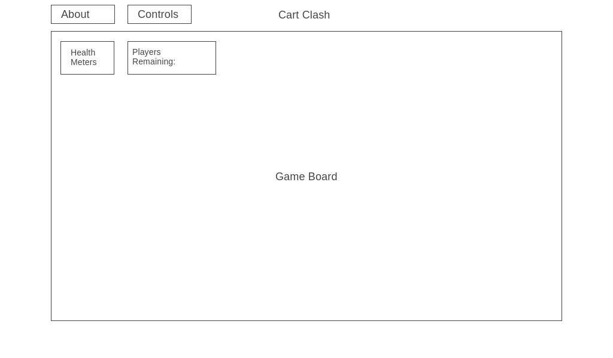

# Whiplash

The goal is to pop/destroy your opponents’ balloons (lives) before your own balloons are popped; the game is similar to Mario Kart’s Battle Mode ([https://www.mariowiki.com/Battle_Mode](https://www.mariowiki.com/Battle_Mode)). The user can drive around the grid with WASD, fire projectiles at opponents and perform other moves with other keys. Players will lose health when hit by projectiles. Initially, the game will be 2-player with no CPUs.

The user’s perspective will be a fixed aerial view of the map. While appearing 2D, the map will have ramps and/or bridges and sections that are higher, lower, or seperated from others. The mouse will not be utilized outside of menu navigation.

## Functionality & MVPs
This game will include the following features:
- Drive around the map in go carts with WASD or other keys
- Launch projectiles at opponent(s)
- Perks located in random locations on the map; 
- Collision detection (projectiles colliding with go carts)

Other functionality
- This project will include instructions and a README.
- Navigate the game menu, select settings, and start game
- See meters or graphics that represent players' remaining health/lives

## WireFrame

## Implementation Timeline
- Friday Afternoon: Setup project (repo, webpack, etc.). Get canvas, players, and map objects to show up on the screen.

- Weekend: Implement keyup/keydown events to make players' cars move. Work on finding/creating graphics for animating the game. Construct game map class. Begin collision detection & response.

- Monday: Resume work on collision detection/response. Create projectiles class - have them spawn on the map and be added to a player's inventory upon contact. allow player to shoot and let projectiles bounce wall to wall, expiring after a certain time.

- Tuesday: Create all view objects that aren't the game canvas (loading screen, navigation menu, game option selection, (optional) sound button and music)

- Thursday: Deploy to GitHub pages. Convert proposal README to production README if time allows.

## Bonus Features
- More potential perks and map obstacles (i.e. land mines, health packs, turbo, etc.)
- CPU/AI opponents
- Animate the go carts: angle carts on turns, make the tires appear to spin, show player health with hearts or balloons
- Allow player to input name and choose car color

